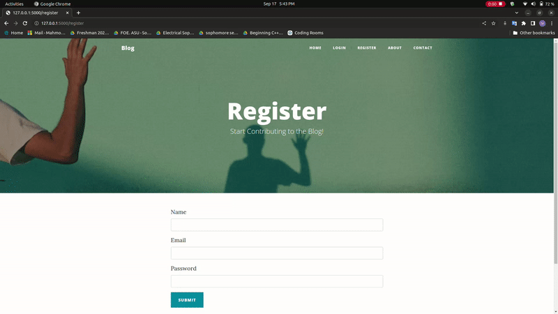
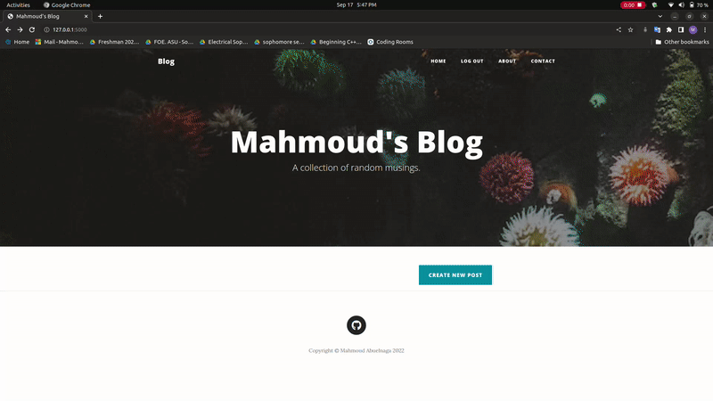
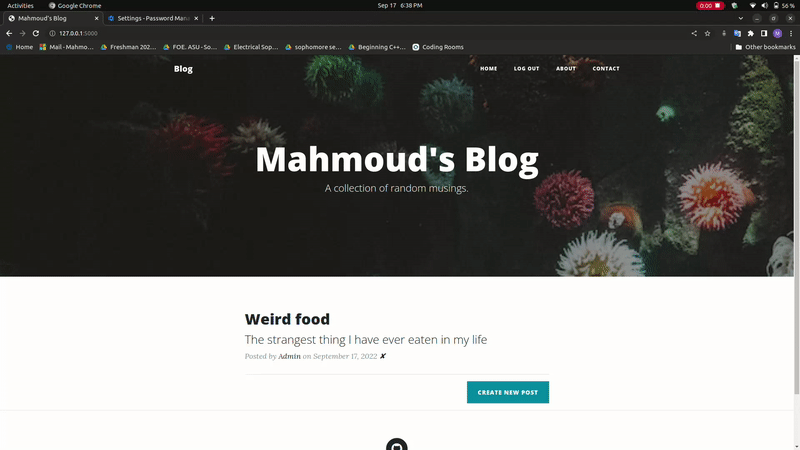
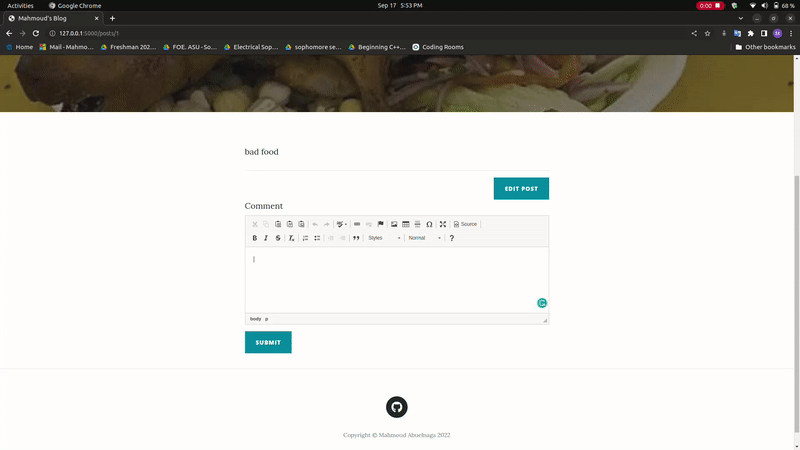
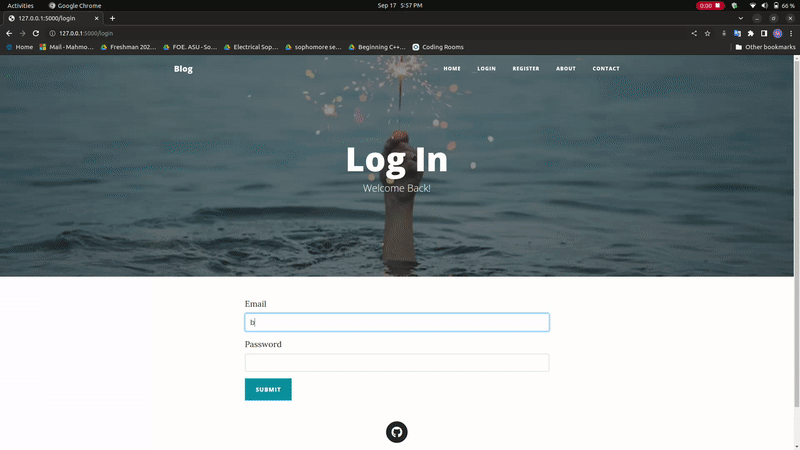

# Blog Site
Web server application. Blog site where you can share your own experiences.

## Instructions
- Install packages in requirements.txt using the command: "pip3 install -r requirements.txt"
- run main.py
- The first person who registers is the admin and is able to create, edit and delete posts.
- Any users who register later can comment on posts.

## Demo

### Register

### Add Post

### Delete Post

### Add Comment

### Logged in user view

### Non authenticated user view
